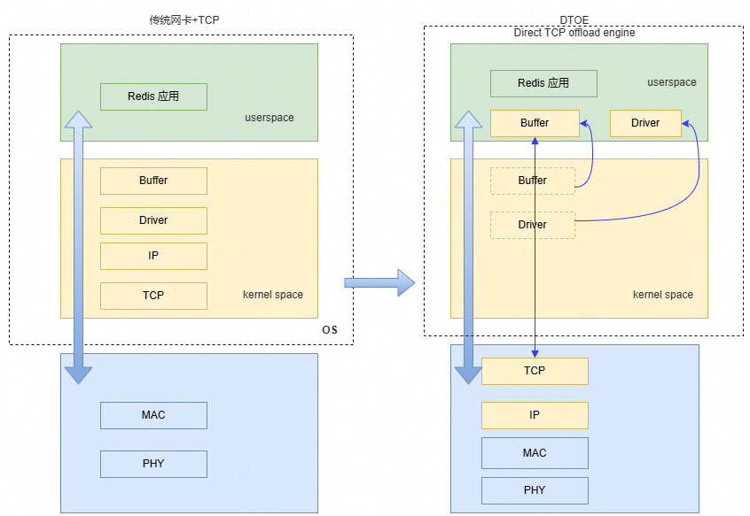
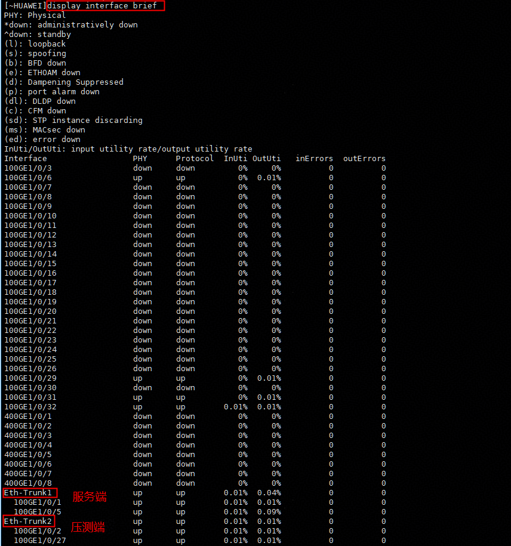
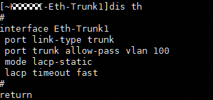

# Redis DTOE优化 特性指南<a name="ZH-CN_TOPIC_0000002526140634"></a>

## 特性描述<a name="ZH-CN_TOPIC_0000002515677794"></a>

本文主要介绍如何在使用openEuler操作系统的鲲鹏920新型号处理器上使能Redis DTOE优化特性及其性能测试方法。

当前Redis客户端与Redis服务端的主备通信流程使用操作系统TCP/IP协议栈，存在如下痛点：

- TCP通信频繁存在软件路径长、上下文切换开销和网络报文拷贝开销大，导致整体CPU开销占比多。
- 硬中断软中断频繁打断业务，影响性能。

DTOE（Direct TOE）是基于网卡TOE（TCP Offload Engine）引擎加速技术，可以将协议栈的数据收发处理流程卸载到网卡内部的CPU进行处理，进而可以将HOST的协议栈处理算力节省出来给其他应用使用，提升应用使用效率。

通过Redis DTOE优化特性为Redis应用加速，提升吞吐量。

**原理描述<a name="section055582731113"></a>**

DTOE是基于网卡TOE（TCP Offload Engine）引擎加速技术，可以将HOST端协议栈的数据收发处理流程卸载到网卡内部的CPU进行处理，DTOE相对传统网卡加TCP的优缺点对比如[**图 1** 传统网卡+TCP与DTOE对比图](#传统网卡+TCP与DTOE对比图)所示。

**图 1** 传统网卡+TCP与DTOE对比图<a name="fig118228136714"></a><a id="传统网卡+TCP与DTOE对比图"></a>



**表 1** 传统网卡+TCP与DTOE对比<a id="传统网卡+TCP与DTOE对比"></a>

|项目|优点|缺点|
|--|--|--|
|传统网卡+TCP|基础方案，对NIC要求比较少|传统网卡需要CPU处理TCP/IP协议，资源消耗严重|
|DTOE|芯片实现TCP/IP协议栈，bypass内核协议栈用户态数据面直通，消除跨态内存拷贝|专用驱动，需要Redis侧适配|


**约束与限制<a name="section145951846101417"></a>**

当前特性仅支持组bond 模式4、不支持本地通讯、pipeline、主从、集群、容器、虚拟网络场景。


## 环境要求<a name="ZH-CN_TOPIC_0000002547277635"></a>

本文基于特定环境提供指导，在正式操作前请确保软硬件均满足要求。

**表 1** 硬件要求<a id="硬件要求"></a>

|项目|规格|
|--|--|
|CPU|鲲鹏920新型号处理器、鲲鹏950处理器|
|网卡|1823网卡 (2*100GE)|


**表 2** 操作系统和软件要求<a id="操作系统和软件要求"></a>

|项目|版本|获取地址|
|--|--|--|
|操作系统|openEuler 22.03 LTS SP4|[获取链接](https://repo.huaweicloud.com/openeuler/openEuler-22.03-LTS-SP4/ISO/aarch64/openEuler-22.03-LTS-SP4-everything-aarch64-dvd.iso)|
|操作系统|openEuler 24.03 LTS SP2|[获取链接](https://repo.huaweicloud.com/openeuler/openEuler-22.03-LTS-SP4/ISO/aarch64/openEuler-22.03-LTS-SP4-everything-aarch64-dvd.iso)|
|网卡及DTOE相关驱动|预计3月份待DTOE更新|预计3月份待DTOE更新|
|网卡及DTOE相关驱动|预计3月份待DTOE更新|预计3月份待DTOE更新|
|knet dtoe|-|[获取链接](https://gitcode.com/openeuler/knet/tree/dtoe)|
|Redis|7.0.15|[获取链接](https://download.redis.io/releases/redis-7.0.15.tar.gz)|
|Redis DTOE Patch|redis-7.0.15-adapt-dtoe.patch|[获取链接](https://gitcode.com/boostkit/Redis)|


## 安装部署DTOE<a name="ZH-CN_TOPIC_0000002525493504"></a>

### 安装DTOE驱动包<a name="ZH-CN_TOPIC_0000002556532037"></a>

**前提条件<a name="zh-cn_topic_0000002525491122_title103mcpsimp"></a>**

- 标卡已完成了OS的部署。

**安装软件包<a name="zh-cn_topic_0000002525491122_title107mcpsimp"></a>**

仅首次安装或升级时，参见以下操作步骤执行一次安装部署软件。

1. 获取DTOE驱动包，并将DTOE驱动包上传至环境，驱动包列表如下：

    ```
    hisdk3-{version}.oe2403sp2.aarch64-1.aarch64.rpm
    hinic3-{version}.oe2403sp2.aarch64-1.aarch64.rpm 
    dtoe-lib-{version}.aarch64.rpm 
    dtoecore-{version}.oe2403sp2.aarch64-1.aarch64.rpm 
    hidtoe3-{version}.oe2403sp2.aarch64-1.aarch64.rpm 
    ```

2. 执行如下命令确认环境上是否已安装驱动包（升级场景），首次安装场景从步骤4开始操作。

    ```
    rpm -qa|grep -E 'hinic3|dtoecore|hidtoe|hisdk3|dtoe-lib'
    ```

    若出现如下回显，说明环境上已安装驱动包，执行步骤3卸载驱动包，若无回显，执行步骤4安装驱动包。

    ```
    [root@localhost ~]# rpm -qa|grep -E 'hinic3|dtoecore|hidtoe|hisdk3|dtoe-lib' 
    dtoe-lib-{version}.aarch64 
    hinic3-{version}.oe2403sp2.aarch64-1.aarch64 
    dtoecore-{version}.oe2403sp2.aarch64-1.aarch64 
    hisdk3-{version}.oe2403sp2.aarch64-1.aarch64 
    hidtoe3-{version}.oe2403sp2.aarch64-1.aarch64
    ```

3. 执行如下命令卸载环境上已有的驱动包，需卸载的驱动参考步骤2中的回显。

    ```
    # 按照步骤2中的回显卸载已安装的驱动包，如未安装则无需卸载 
    rpm -e dtoecore dtoe-lib hidtoe3 hisdk3 hinic3
    ```

4. 执行如下命令安装最新版版的驱动软件包。

    ``` 
    rpm -ivh hisdk3-{version}.oe2403sp2.aarch64-1.aarch64 
    rpm -ivh hinic3-{version}.oe2403sp2.aarch64-1.aarch64
    rpm -ivh dtoe-lib-{version}.aarch64
    rpm -ivh dtoecore-{version}.oe2403sp2.aarch64-1.aarch64 
    rpm -ivh hidtoe3-{version}.oe2403sp2.aarch64-1.aarch64
    ```

    > **说明：** 
    >-   驱动包安装完成后reboot生效，reboot步骤可在安装DTOE固件包之后进行。


### 安装DTOE固件包<a name="ZH-CN_TOPIC_0000002525332190"></a>

1. 获取DTOE固件Hinic3\_flash.bin，将该文件上传至环境上。
2. 执行以下命令将该固件更新到标卡环境上。

    ```
    hinicadm3 updatefw -i hinic0 -f {编译的NPU固件} -a cold
    ```

    打印信息如下所示，表示执行成功。

    ```
    Please do not remove driver or network device. 
    Loading... 
    Firmware update start: 2025-07-01 08:35:38 
    [>>>>>>>>>>>>>>>>>>>>>>>>>>>>>>>>>>>>>>>>>>>>>>>>>>] [100%][\] 
    Firmware update finish: 2025-07-01 08:36:13 
    Firmware update time used: 35s 
    Loading firmware image succeed. 
    Set update active cfg succeed! 
    Please reboot OS to take firmware effect.
    ```

3. 在Host OS执行reboot命令重启服务器OS，使软件包生效。


### 关闭iommu<a name="ZH-CN_TOPIC_0000002556372057"></a>

使用dtoe功能需要关闭iommu，执行如下命令关闭iommu：
1. 打开grub文件。
```
vim /etc/default/grub
```
2. 按i进入编辑模式，在GRUB_CMDLINE_LINUX后添加iommu=off。
3. 按“Esc”键，输入:wq!，按“Enter”保存并退出编辑。


### 更新grub<a name="ZH-CN_TOPIC_0000002525492130"></a>

执行如下命令更新grub：

```
sudo grub2-mkconfig -o /boot/grub2/grub.cfg
```


### 关闭防火墙<a name="ZH-CN_TOPIC_0000002556532039"></a>

执行如下命令关闭防火墙：

```
sudo systemctl stop firewalld
```


## 组建网络<a name="ZH-CN_TOPIC_0000002525492128"></a>

使能Redis DTOE优化特性需要分别在Redis服务端服务器和压测端服务器组建Bond 0网络。

1. 在目录“/etc/sysconfig/network-scripts/”创建如下4个文件。
    - ifcfg-bond0文件及其文件内容如下所示。

        ```
        DEVICE=bond0
        ONBOOT=yes
        BOOTPROTO=static
        BONDING_MASTER=yes
        BONDING_OPTS='mode=4 xmit_hash_policy=4  miimon=100 updelay=0 downdelay=0 lacp_rate=fast'
        BONDING_SLAVE0=eno1 # 换成环境中100G的网口
        BONDING_SLAVE1=eno2 # 换成环境中100G的网口
        MTU=9000
        USERCTL=no
        ```

    - ifcfg-bond0.100文件及其内容如下所示。

        ```
        DEVICE=bond0.100
        IPADDR=192.168.1.140  #根据实际环境修改
        BOOTPROTO=static
        PHYSDEV=bond0
        ONBOOT=yes
        USERCTL=no
        VLAN=yes
        VID=100
        ```

    - ifcfg-eno1文件及其内容如下所示。注意，需将eno1换成真实100G网口的名称。

        ```
        TYPE=Ethernet
        BOOTPROTO=static
        DEVICE="eno1"
        ONBOOT=yes
        MASTER=bond0
        SLAVE=yes
        NAME=eno1
        ```

    - ifcfg-eno2文件及其内容如下所示。注意，需将eno2换成真实100G网口的名称。

        ```
        TYPE=Ethernet
        BOOTPROTO=static
        DEVICE="eno2"
        ONBOOT=yes
        MASTER=bond0
        SLAVE=yes
        NAME=en02
        ```

2. 完成配置后需要重启服务器生效。
3. 登录交换机。
4. 查看交换机上所有可用的物理接口。

    ```
    display interface brief
    ```

    

    > **说明：** 
    >如上图所示，检查Server端组Bond 0的SP670网卡的两个100G网口eth1和eth2对应交换机上的端口状态为**up**且没有在Eth-Trunk组内。下文以100GE 1/0/1和100GE 1/0/5端口为例进行Bond 0配置。

5. Redis 服务端服务器，创建聚合组Eth-Trunk 1，并将物理接口100GE 1/0/33和100GE 1/0/34加入Eth-Trunk 1。

    ```
    sys
    interface Eth-Trunk 1
    port link-type trunk
    port trunk allow-pass vlan 100
    mode lacp-static
    lacp timeout fast
    commit 
    quit 
      
    interface 100GE 1/0/33 
    Eth-Trunk 1 
    commit 
    quit 
      
    interface 100GE 1/0/34 
    Eth-Trunk 1 
    commit 
    quit
    ```

    

6. Redis压测端服务器的Bond 0两个100GE网口，参考步骤5进行类似操作。


## 编译与使能特性<a name="ZH-CN_TOPIC_0000002556533435"></a>

1. 下载knet dtoe源码、编译并安装。

    ```
    sudo yum install cmake libboundscheck.aarch64 libcap.aarch64 libcap-devel.aarch64
    git clone https://gitcode.com/openeuler/knet.git
    cd knet 
    git checkout dtoe
    python3 build.py Release dtoe rpm
    rpm -ivh ./build/rpmbuild/RPMS/ubs-knet-1.0.0.aarch64.rpm --nodeps --force
    ```

2. 下载kbdtoe库源码、编译并安装。

    ```
    git clone https://gitcode.com/boostkit/redis-dtoe.git
    cd redis-dtoe
    mkdir build
    cmake  ..
    make -j
    cmake --install .
    ```

    命令**cmake --install .** 默认会将kbdtoe.h和libkbdtoe.so文件分别安装到/usr/include/和/usr/lib64。

3. 将Redis中的**redis-7.0.15-adapt-dtoe.patch** 移到Redis源码目录下，执行合入patch的命令。

    ```
    git clone https://gitcode.com/BoostKit/Redis.git
    cd Redis
    cp redis-7.0.15-adapt-dtoe.patch path/redis-7.0.15/
    cd path/redis-7.0.15
    patch -p1 < redis-7.0.15-adapt-dtoe.patch
    ```

4. 重新编译Redis。

    ```
    cd path/redis-7.0.15
    make distclean
    make -j
    ```


## 验证特性<a name="ZH-CN_TOPIC_0000002547432289"></a>

Redis DTOE优化特性必须基于远端压测，不支持本地压测，需要在redis.conf中修改dtoe-ip的值与实际环境相符合。

**功能测试<a name="section195844115224"></a>**

1. 修改redis.conf文件中dtoe-ip字段。

    ```
    dtoe-ip "" # 该字段改成dtoe bond 0的ip地址，目前只支持ipv4
    protected-mode yes #改成no
    ```

2. 在Server端环境启动一个适配DTOE特性后的redis-server实例。

    ```
    cd path/redis-7.0.15
    ./src/redis-server ./redis.conf --bind 0.0.0.0 --port 6379
    ```

3. 在Client端环境中进入Redis目录，使用下面命令测试。

    ```
    cd path/redis-7.0.15
    ./src/redis-benchmark -h server-ip -p server-port -c 50 -t set,get -n 10000000 -r 10000000 -d 3 --threads 20 # -d 3 这里3可以设置为其它值，如10，128，1024，4096
    ```

    测试结果类似如下。

    ```
    ./src/redis-benchmark -h 192.168.220.156 -p 6379 -c 50  -t set,get -n 10000000  -r 10000000 -d 3 --threads 20
    ====== SET ======                                                     
      10000000 requests completed in 19.78 seconds
      50 parallel clients
      3 bytes payload
      keep alive: 1
      host configuration "save": 
      host configuration "appendonly": no
      multi-thread: yes
      threads: 20
    ........ 省略
    Summary:
      throughput summary: 505637.84 requests per second
      latency summary (msec):
              avg       min       p50       p95       p99       max
            0.086     0.024     0.087     0.135     0.167     2.383
    ====== GET ======                                                     
      10000000 requests completed in 16.75 seconds
      50 parallel clients
      3 bytes payload
      keep alive: 1
      host configuration "save": 
      host configuration "appendonly": no
      multi-thread: yes
      threads: 20
    ......省略
    Summary:
      throughput summary: 596872.38 requests per second
      latency summary (msec):
              avg       min       p50       p95       p99       max
            0.071     0.024     0.071     0.103     0.127     1.199
    ```

4. 在Client端环境中也可以使用redis-cli和memtier-benchmark工具测试。

    若redis-server使能dtoe成功会回显下面内容：

    ```
    20043:C 05 Mar 2026 14:35:32.474 # oO0OoO0OoO0Oo Redis is starting oO0OoO0OoO0Oo
    20043:C 05 Mar 2026 14:35:32.474 # Redis version=7.0.15, bits=64, commit=2b2ae940, modified=1, pid=20043, just started
    20043:C 05 Mar 2026 14:35:32.474 # Configuration loaded
    20043:M 05 Mar 2026 14:35:32.474 * monotonic clock: POSIX clock_gettime
    ... ... ...
    20043:M 05 Mar 2026 14:35:32.475 # Server initialized
    20043:M 05 Mar 2026 14:35:32.475 # WARNING Memory overcommit must be enabled! Without it, a background save or replication may fail under low memory condition. Being disabled, it can can also cause failures without low memory condition, see https://github.com/jemalloc/jemalloc/issues/1328. To fix this issue add 'vm.overcommit_memory = 1' to /etc/sysctl.conf and then reboot or run the command 'sysctl vm.overcommit_memory=1' for this to take effect.
    20043:M 05 Mar 2026 14:35:34.097 * user used dtoe feature and kbdtoe init success.
    ```

**性能测试<a name="section11899125117230"></a>**

性能测试采用Redis自带的redis-benchmark工具测试data-size为10和128字节分别在以下三个场景下性能有提升。

- 单实例/10实例相比原生Redis绑核，中断NUMA均衡绑核。

1. 在Server端执行一下命令进行基础环境配置。

    ```
    #停止irqbalance服务
    systemctl stop irqbalance.service
    # 关闭irpbalance
    systemctl disable irqbalance.service
    ulimit -n 65536
    #网卡中断绑核
    #下面的enp65s0f0和enp65s0f1根据实际环境进行修改
    ethtool -L enp65s0f0 combined 32
    ethtool -L enp65s0f1 combined 32
    irq1=`cat /proc/interrupts| grep  enp65s0f0  | awk -F ':' '{print $1}'`
    irq1=`echo $irq1`
    #选择每个NUMA最后8个核
    cpulist=({72..79} {152..159} {232..239} {312..319})
    c=0
    for irq in $irq1
    do
        echo ${cpulist[c]} "->" $irq
        echo ${cpulist[c]} > /proc/irq/$irq/smp_affinity_list
        let "c++"
    done
    
    irq1=`cat /proc/interrupts| grep enp65s0f1  | awk -F ':' '{print $1}'`
    irq1=`echo $irq1`
    cpulist=({61..68} {141..148} {221..228} {301..308})
    c=0
    for irq in $irq1
    do
        echo ${cpulist[c]} "->" $irq
        echo ${cpulist[c]} > /proc/irq/$irq/smp_affinity_list
        let "c++"
    done
    #关闭防火墙
    ```

2. 测试脚本自行准备，压测命令参考如下。

    ```
    redis-benchmark -h server-ip -p port -c 50  -t set,get  -n 10000000  -r 10000000 -d data-size --threads 20
    #server-ip是实际环境中redis-server的ip
    #port是实际环境中redis-server的port
    #data-size大小可以是10和128
    ```

3. 检查单实例/10实例在data-size为10字节时性能提升至少100%；检查单实例/10实例在data-size为128字节时性能提升至少70%。


## 安全检查与加固<a name="ZH-CN_TOPIC_0000002549929817"></a>

ASLR（Address Space Layout Randomization，地址空间布局随机化）是一种针对缓冲区溢出的安全保护技术，通过对堆、栈、共享库映射等线性区布局的随机化，增加攻击者预测目的地址的难度，防止攻击者直接定位攻击代码位置，达到阻止溢出攻击的目的。

```
echo 2 >/proc/sys/kernel/randomize_va_space
```


|发布日期|修订记录|
|--|--|
|2026-03-30|第一次正式发布。|


